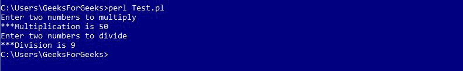
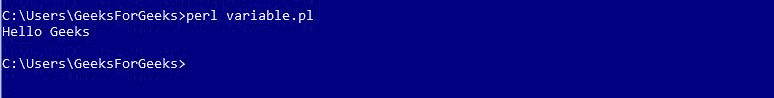

# Perl |模块

> 原文:[https://www.geeksforgeeks.org/perl-modules/](https://www.geeksforgeeks.org/perl-modules/)

Perl 中的模块是执行一组编程任务的相关子程序和变量的集合。Perl 模块是可重用的。各种各样的 Perl 模块可以在综合 Perl 存档网络(CPAN)上获得。这些模块涵盖了广泛的类别，如网络、CGI、XML 处理、数据库接口等。

**Creating a Perl Module**

模块名称必须与包的名称相同，并应以结尾。pm 分机。

**示例:Calculator.pm**

```perl
package Calculator;

# Defining sub-routine for Multiplication
sub multiplication
{
    # Initializing Variables a & b
    $a = $_[0];
    $b = $_[1];

    # Performing the operation
    $a = $a * $b;

    # Function to print the Sum
    print "\n***Multiplication is $a";
}

# Defining sub-routine for Division
sub division
{
    # Initializing Variables a & b
    $a = $_[0];
    $b = $_[1];

    # Performing the operation
    $a = $a / $b;

    # Function to print the answer
    print "\n***Division is $a";
}
1;
```

这里，文件的名称是“Calculator.pm”，存储在 Calculator 目录中。注意 1；写在代码的末尾，向解释器返回一个真值。Perl 接受任何真实的东西，而不是 1

<center>**Importing and using a Perl Module**</center>

To import this calculator module, we use require or use functions. To access a function or a variable from a module, :: is used. Here is an example demonstrating the same:

**示例:Test.pl**

```perl
#!/usr/bin/perl

# Using the Package 'Calculator'
use Calculator;

print "Enter two numbers to multiply";

# Defining values to the variables
$a = 5;
$b = 10;

# Subroutine call
Calculator::multiplication($a, $b);

print "\nEnter two numbers to divide";

# Defining values to the variables
$a = 45;
$b = 5;

# Subroutine call
Calculator::division($a, $b);
```

**输出:**


**Using Variables from modules**

不同包中的变量可以通过在使用前声明来使用。下面的例子演示了这个
T1】例子:Message.pm

```perl
#!/usr/bin/perl

package Message;

# Variable Creation
$username;

# Defining subroutine
sub Hello
{
  print "Hello $username\n";
}
1;
```

Perl 文件访问模块如下
**示例**

```perl
#!/usr/bin/perl

# Using Message.pm package
use Message;

# Defining value to variable
$Message::username = "Geeks";

# Subroutine call
Message::Hello();
```

**输出:**


<center>**Using Pre-defined Modules**</center>

Perl provides various pre-defined modules which can be used in the Perl programs anytime.
Such as: ‘strict’, ‘warnings’, etc.

**示例:**

```perl
#!/usr/bin/perl

use strict;
use warnings;

print" Hello This program uses Pre-defined Modules";
```

**输出:**

```perl
Hello This program uses Pre-defined Modules
```