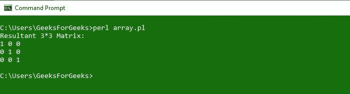

# Perl |多维数组

> 原文:[https://www.geeksforgeeks.org/perl-multidimensional-arrays/](https://www.geeksforgeeks.org/perl-multidimensional-arrays/)

[Perl](https://www.geeksforgeeks.org/introduction-to-perl/) 中的多维数组是具有多个维度的[数组](https://www.geeksforgeeks.org/perl-arrays/)。从技术上讲，在 Perl 中没有多维数组这种东西，但是数组是用来充当多维数组的。多维数组以行和列的形式表示，也称为**矩阵。**一个数组的每个元素都可以是另一个数组的**引用**，但是在语法上，它们看起来像一个二维数组。

多维数组只能保存标量值，不能保存数组或哈希值。

### 多维数组的初始化和声明

下面给出的例子说明了多维数组的初始化和声明。
在本例中，我们将简单地通过**@ array _ name =([……]，[……]，[……])初始化数组；**。

## Perl 语言

```perl
#!/usr/bin/perl
use strict;
use warnings;

# Initializing and defining the array
my @items = ( ['book', 'pen', 'pencil'],
              ['Bat', 'Ball', 'Stumps'],
              ['snake', 'rat', 'rabbit'] );

# Printing items from the array
print $items[0][0], "\n";
print $items[1][1], "\n";
print $items[2][2], "\n";
```

**输出:**


### 创建矩阵

矩阵是多个维度上的数组的行和列的集合。
我们来看一个例子，让大家更清楚在 Perl 中创建矩阵。

**示例 1:**
在本例中，我们首先声明了三个带值的数组，然后将它们合并成最终的结果数组，形成一个 **3*3 矩阵。**为了控制变量 **$m 和$n** ，使用了两个 for 循环。

## Perl 语言

```perl
#!/usr/bin/perl
use strict;
use warnings;

# Array Declaration
my @arrayA = qw(1 0 0); 
my @arrayB = qw(0 1 0); 
my @arrayC = qw(0 0 1); 

# Merging 3 arrays into One Final array 
my @result = (\@arrayA, \@arrayB, \@arrayC);

print "Resultant 3*3 Matrix:\n"; 

# Using For loop
for(my $m = 0; $m <= $#result; $m++)
{  
   for(my $n = 0; $n <= $#result ; $n++)
   { 
      print "$result[$m][$n] "; 
   } 
   print "\n"; 
} 
```

**输出:**



**示例 2:**
在本例中，我们将从键盘获取输入，然后将两个矩阵相加，并使用结果矩阵打印结果。

## Perl 语言

```perl
#!usr/bin/perl
use strict;
use warnings;

my (@MatrixA, @MatrixB, @Resultant) = ((), (), ());

# Asking for User Input for Matrix A
print "Please Provide the order of MatrixA :\n";
print "\tMatrixA rows:";
chomp(my $rowA = <>);  # CHOMP TO TAKE USER INPUT
print "\tMatrixA columns:";
chomp(my $columnA = <>);

# Asking for User Input for Matrix B
print "Please Provide the order of MatrixB :\n";
print "\tMatrixB rows:";
chomp(my $rowB = <>);
print "\tMatrixB columns:";
chomp(my $columnB = <>);

# Asking User to input elements of matrices
if ($rowA == $rowB and $columnA == $columnB)
{
    print "Enter $rowA * $columnA elements in MatrixA:\n";
    foreach my $m (0..$rowA - 1)
    {
        foreach my $n (0..$columnA - 1)
        {
            chomp($MatrixA[$m][$n] = <>);  # TO READ THE VALUES
        }
    }

    print "Enter $rowB * $columnB elements in MatrixB:\n";
    foreach my $m (0..$rowB - 1)
    {
        foreach my $n (0..$columnB - 1)
        {
            chomp($MatrixB[$m][$n] = <>);  # TO READ THE VALUES
        }
    }

    # Performing Addition operation
    foreach my $m (0..$rowB - 1)
    {
        foreach my $n (0..$columnB - 1)
        {
            $Resultant[$m][$n] = $MatrixA[$m][$n] +
                                 $MatrixB[$m][$n];
        }
    }

    # Printing Matrix A
    print "MatrixA is :\n";
    foreach my $m (0..$rowB - 1)
    {
        foreach my $n (0..$columnB - 1)
        {
            print "$MatrixA[$m][$n] ";
        }
        print "\n";
    }

    # Printing Matrix B
    print "MatrixB is :\n";
    foreach my $m (0..$rowB - 1)
    {
        foreach my $n (0..$columnB - 1)
        {
            print "$MatrixB[$m][$n] ";
        }
        print "\n";
    }

    # Printing the sum of Matrices
    print "SUM of MatrixA and MatrixB is :\n";
    foreach my $m (0..$rowB - 1)
    {
        foreach my $n (0..$columnB - 1)
        {
            print "$Resultant[$m][$n] ";
        }
        print "\n";
    }
}

# Error if Matrices are of different order
else
{
    print "Matrices order does not MATCH, Addition is not Possible";
}
```

**输出:**


只有当矩阵具有相同的顺序时，才能执行矩阵相加。


### 数组的数组

数组数组是具有数组的数据结构，该数组具有数组引用列表。数组中的元素是数组引用。根据需要，可以单独打印这些参考，也可以打印整个阵列。

**语法:**

```perl
@ARRAY_NAME = ([value1], [value2], [value3], ..., [valueN]);
```

**例 1:**

## Perl 语言

```perl
#!/usr/bin/perl
use strict;
use warnings;

# Array of Arrays
my @GfG = ( ["Geek",  "For",  "Geeks"],
            ["Is",    "Best", "For"],
            ["Those", "In",  "Need"] );

# Printing internal array elements
print "Accessing Array elements:\n";
print  @{$GfG[0]}[1], "\n"; # For accessing particular array element
print  @{$GfG[1]}[0], "\n";
print  @{$GfG[2]}[2], "\n";

# Printing whole Arrays
print "\nAccessing whole arrays: \n";
print @{$GfG[0]}, "\n"; # For accessing particular array
print @{$GfG[1]}, "\n";
print @{$GfG[2]}, "\n";
print "\n";
```

**输出:**


**例 2:**

在这个例子中，我们通过使用单个数组生成了一个数组数组。

## Perl 语言

```perl
#!/usr/bin/perl
use strict;
use warnings;
use Data::Dumper;

my @GfG = ( ["SAM",  "SHABANAM",  "SOHAM"],
            ["DHONI", "GONI", "AVNI"],
            ["VIRAT", "STUART", "ROHIT"] );
my @test;
foreach (@GfG)
{
    if ($_ =~ /M/ )
    {
        push ( @{$test[0]}, $_);
    }
    elsif ($_ =~ /I/ )
    {
        push ( @{$test[1]}, $_);
    }
    else
    {
        push ( @{$test[2]}, $_);
    }
}

print Dumper(\@test), "\n";
```

**输出:**


### 哈希数组

散列数组是一种数据结构，其中数组有一个散列列表。散列引用是数组的对象。为了访问键和值，我们需要取消对它们的引用。
如果我们想在数字上循环散列，散列数组是一个很好的数据结构。

**语法:**

```perl
@ARRAY_NAME = ({KEY1 => VALUE1}, {KEY2 => VALUE2});
```

**例 1:**

## Perl 语言

```perl
#!/usr/bin/perl
use strict;
use warnings;

my @hashtest = ({ First => "Geek",
                  Middle => "For",
                  Last => "Geeks" },
                { Street => "Royal Kapsons",
                  City => "Noida-Uttar Pradesh" },
                { About => "Computer Science portal",
                  Content => "Technical" });

# To access any of the hash reference.
print $hashtest[0], "\n";

# To access keys of any hash reference.
print keys %{$hashtest[2]}, "\n";

# To access any value of any key.
print $hashtest[0]->{"First"}, "\n";
print $hashtest[0]->{"Middle"}, "\n";
print $hashtest[0]->{"Last"}, "\n";
```

**输出:**


**示例 2:**
从一个简单的数组生成一个哈希数组。

## Perl 语言

```perl
#!/usr/bin/perl
use strict;
use warnings;

use Data::Dumper;

my @array = ("Item - Java Course",
             "Cost - 5000",
             "Ratings - 5 star");

# Empty array of hashes
my @array_1;

foreach (@array)
{
    my @array = split(" - ", $_);
    $array_1[0]->{$array[0]} = $array[1];
}

print Dumper (\@array_1);
```

**输出:**

