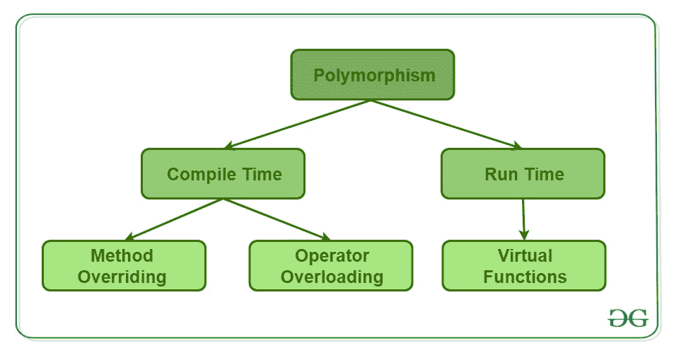

# Perl | OOPs 中的多态性

> 原文:[https://www.geeksforgeeks.org/perl-polymorphism-in-oops/](https://www.geeksforgeeks.org/perl-polymorphism-in-oops/)

**多态性**是任何数据能够以多种形式处理的能力。这个词本身的意思是 **`poly`** 表示**多****`morphism`**表示**类型**。多态性是面向对象编程语言最重要的概念之一。多态在面向对象编程中最常见的用途是当父类引用被用来引用子类对象时。在这里，我们将看到如何以多种类型和多种形式表示任何函数。
多态性的现实生活例子，一个人在同一时间可以有不同的角色在生活中扮演。喜欢一个女人的同时是母亲、妻子、员工和女儿。因此，同一个人必须有许多特征，但必须根据情况和条件实现每一个特征。多态性被认为是面向对象编程的重要特征之一。

**多态性**是面向对象编程的关键动力。不支持多态性的语言不能宣传自己是面向对象的语言，这一点非常重要。拥有类但没有多态性能力的语言称为基于对象的语言。因此，对于一种面向对象的编程语言来说，这是非常重要的。
指的是一个物体或参照物在不同情况下采取多种形式的能力。它实现了函数重载、函数覆盖和虚函数的概念。



> 多态性是一种属性，通过它可以将任何消息发送到多个类的对象，并且每个对象都有根据类属性以适当方式响应的趋势。

这意味着多态是面向对象编程语言中的方法，它根据调用它的对象的类做不同的事情。例如，$square->area()将返回正方形的面积，但是$triangle->area()可能会返回三角形的面积。另一方面，$object->area()必须根据调用哪个类$object 来计算面积。

多态性可以通过下面的例子得到最好的解释:

```
use warnings;

# Creating class using package
package A;

# Constructor creation
sub new
{

    # shift will take package name 'vehicle' 
    # and assign it to variable 'class'
    my $class = shift;
    my $self = {
                  'name' => shift,
                  'roll_no' => shift
               };

    sub poly_example
    {
      print("This corresponds to class A\n");
    }
};

package B;

# The @ISA array contains a list 
# of that class's parent classes, if any
my @ISA = (A);

sub poly_example
{
  print("This corresponds to class B\n");

}

package main;

B->poly_example();
A->poly_example();
```

**输出:**


对于第一个输出，B 类中定义的 poly_example()方法会覆盖从 A 类继承的定义，对于第二个输出，反之亦然。这使得能够添加或扩展任何预先存在的包的功能，而无需一次又一次地重写整个类的整个定义。从而使程序员很容易。