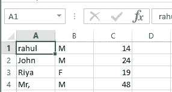
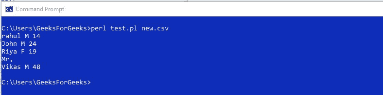

# Perl |读取 CSV 文件

> 原文:[https://www.geeksforgeeks.org/perl-reading-a-csv-file/](https://www.geeksforgeeks.org/perl-reading-a-csv-file/)

[Perl](https://www.geeksforgeeks.org/introduction-to-perl/) 最初是为文本处理而开发的，比如从指定的文本文件中提取所需的信息，并将文本文件转换成不同的形式。在 Perl 中，读取文本文件是一项非常常见的任务。例如，您经常会遇到读取 CSV(逗号分隔值)文件来提取数据和信息的情况。

可以使用任何文本编辑器创建 CSV 文件，如*记事本*、*记事本++* 等。将内容添加到记事本中的文本文件后，使用**将其存储为 csv 文件。csv** 扩展。

**CSV 文件示例:**


```perl
Store the above file as new.csv
```

CSV 文件可用于管理企业或公司数据库的记录文件。这些文件可以很容易地在 Excel 中打开，并且可以使用任何合适的软件进行操作。Perl 还通过从文件中提取值、操作这些值并将它们恢复到文件中来支持这些“csv”文件的操作和创建。为了从特定行中提取每个值，我们将使用**分割**功能。

**Use of Split() for data extraction**

[split()](https://www.geeksforgeeks.org/perl-split-function/) 是 Perl 中的一个预定义函数，用于在分隔符的帮助下将字符串分成多个部分。根据用户的要求，这个分隔符可以是任何字符，但是一般来说，我们使用逗号作为分隔符。
**split()** 取两个参数。第一个是分隔符，第二个是需要拆分的字符串。

> **语法:** split(_delimiter_，_ string _)；
> **参数:**
> **_delimiter_ :** 元素之间的分隔符值
> **_string_:** 从中提取值
> **返回:**由 _delimiter_
> 分隔的字符串元素数组

**示例:**

```perl
Input: $s = "Johny loves Sugar" 
Output: "Johny", "loves", "Sugar"
If Input string is passed to split function as,
@words = split("", $s);
The array @words will be filled with 3 values: “Johny”, “loves” and “Sugar”.
```

**注:**

```perl
If $words[2] is printed then result will be "Sugar" as array indexing starts from 0.
```

遵循以下步骤，使用分隔符将 CSV 文件的行拆分为多个部分:
**步骤 1:** 逐行读入文件。
**步骤 2:** 对于每一行，将所有值存储在一个数组中。
**第三步:**将所有数值逐一打印出来，得到结果

让我们举个例子来更好地理解这个话题。下面是 **split()** 函数的代码，使用分隔符分隔存储在 new.csv 文件中的字符串:

## Perl 语言

```perl
use strict;

my $file = $ARGV[0] or die;
open(my $data, '<', $file) or die;

while (my $line = <$data>) 
{
    chomp $line;

    # Split the line and store it
    # inside the words array
    my @words = split ", ", $line;  

    for (my $i = 0; $i <= 2; $i++)
    {
        print "$words[$i] ";
    }
    print "\n";
}
```

将上述代码保存在带有**的文本文件中。pl** 分机。在这里，我们将把它保存为 **test.pl**

使用以下命令执行上面保存的文件:

```perl
perl test.pl new.csv
```

**输出:**


**Escaping a comma character**

有时可能有一个文件在字符串的字段中有一个逗号，如果删除它，将会改变数据的含义或使记录变得无用。在这种情况下，如果使用 **split()** 函数，即使在引号内，它也会在每次获得逗号作为分隔符时分隔这些值，因为 **split()** 函数不关心引号，也不了解 CSV。它只是在找到分隔符的地方剪切。

以下是一个逗号分隔的 CSV 文件:


在上面的 CSV 文件中，可以看到第一个字段本身有一个逗号，因此用引号括起来。但是如果我们在这个文件上运行 **split()** 函数，那么它不会关心任何这样的报价。以下是对这样的文件应用 **split()** 函数的结果:


在上面的文件中， **split()** 函数将字符串字段分成几部分，即使它在引号内，也是因为，我们在代码中只打印了三个字段，因此，最后一个字符串的第三个字段被放入输出文件中。

为了处理这种情况，一些限制和作用域被添加到 Perl 中，这些限制允许编译器跳过引号内的字段划分。
我们使用**文本::CSV** ，它允许完整的 CSV 阅读器和编写器。TEXT::CSV 是 Perl 中 MCPAN 的一个模块，它允许许多新的功能，例如读取、解析和写入 CSV 文件。这些模块可以包含在 Perl 程序中，使用以下 pragma:

```perl
use Text::CSV
```

但是首先，需要在您的设备上下载并安装此模块，以使用其功能。

**安装 TEXT::CSV :**
**为 Windows:**

```perl
perl -MCPAN -e shell
install Text::CSV
```

**对于基于 Debian/Ubuntu 的系统:**

```perl
$ sudo apt-get install libtext-csv-perl
```

**对于基于红帽/Centos/Fedora 的系统:**

```perl
$ sudo yum install perl-Text-CSV
```

下面是要在我们的新. csv 文件上运行的代码，用于转义引号中的逗号字符:

## Perl 语言

```perl
use strict;

# Using Text::CSV file to allow
# full CSV Reader and Writer
use Text::CSV;

my $csv = Text::CSV->new({ sep_char => ', ' });

my $file_to_be_read = $ARGV[0] or die;

# Reading the file
open(my $data_file, '<', $file_to_be_read) or die;
while (my $line = <$data_file>) 
{
  chomp $line;

  # Parsing the line
  if ($csv->parse($line)) 
  {

      # Extracting elements
      my @words = $csv->fields();
      for (my $i = 0; $i <= 2; $i++) 
      {
          print "$words[$i] ";
      }

      print "\n";
  } 
  else
  {
      # Warning to be displayed
      warn "Line could not be parsed: $line\n";
  }
}
```

**输出:**


在上面的示例中，可以看到第一个字段现在有一个逗号，该逗号在解析 CSV 文件时被转义。

```perl
my $csv = Text::CSV->new({ sep_char => ', ' }); 
```

用“，”隔开。
上面一行描述了在类上调用构造函数的方式。使用箭头 **- >** 完成构造函数调用。

```perl
$csv->parse($line)
```

这个调用将尝试解析当前行，并将它拆分成几部分。根据成功或失败返回真或假。

**Fields with embedded new-lines**

在 CSV 文件中，也可以有一些多行字段或在单词之间嵌入新行。与没有嵌入新行的其他文件相比，这种多行字段在通过 **split()** 函数时的工作方式非常不同。
**例:**



Perl 提供了一个 **getline()** 方法来处理这类文件。

## Perl 语言

```perl
use strict;

# Using Text::CSV file to allow
# full CSV Reader and Writer
use Text::CSV;

my $file = $ARGV[0] or die;

my $csv = Text::CSV->new (
{
    binary => 1,
    auto_diag => 1,
    sep_char => ', '
});

my $sum = 0;

# Reading the file
open(my $data, '<:encoding(utf8)', $file) or die;

while (my $words = $csv->getline($data)) 
{
    for (my $i = 0; $i < 3; $i++) 
    {
        print "$words->[$i]";
    }
    print "\n";
}

# Checking for End-of-file
if (not $csv->eof) 
{
    $csv->error_diag();
}
close $data;
```

**输出:**



在上面的 CSV 文件中，现在使用 **getline()** 方法处理嵌入的换行符，Perl 按照程序员的要求将新字段视为一个字段，因此放在引号中。