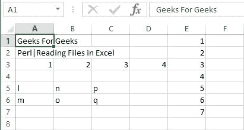
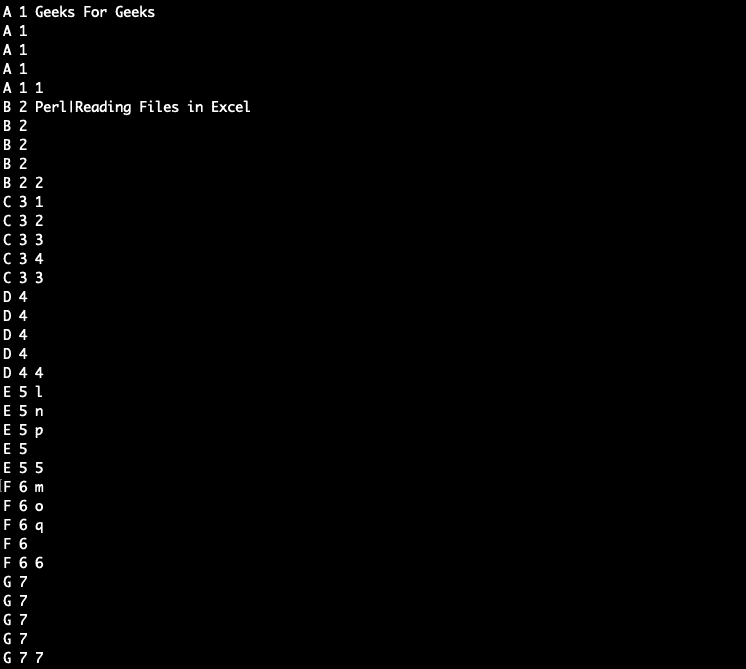
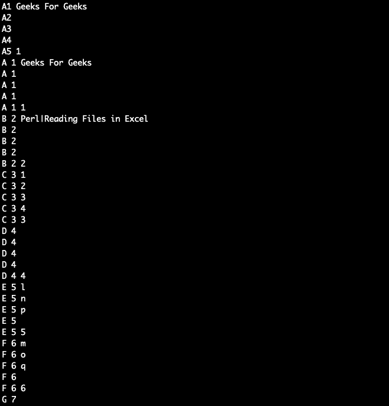

# Perl |读取 Excel 文件

> 原文:[https://www.geeksforgeeks.org/perl-reading-excel-files/](https://www.geeksforgeeks.org/perl-reading-excel-files/)

Excel 工作表是维护办公记录最常用的方法之一，尤其是在非开发人员甚至经理可以批量向系统提供输入的应用程序中。

但是，问题是从微软 Excel 使用 Perl 创建的文件中读取内容。

CPAN 很少提供读取 Excel 文件的模块。有`**Spreadsheet::Read**`将能够处理所有类型的电子表格。还有其他低级库通过不同版本的 Excel 读取文件:

*   电子表格::ParseExcel Excel Excel 95-2003 文件，
*   电子表格::ParseXLSX Excel 2007 打开 XML XLSX

### Excel 文件的创建

Excel 文件可以借助内置模块**[Excel::Writer::XLSX](https://www.geeksforgeeks.org/perl-creating-excel-files/)**使用 Perl 创建，该模块用于创建 Excel 文件。
此外，`**write()**`功能用于向 excel 文件添加内容。
**例:**

```perl
#!/usr/bin/perl
use Excel::Writer::XLSX;
my $Excel_book1  = Excel::Writer::XLSX->new('new_excel.xlsx' );
my $Excel_sheet1 = $Excel_book1->add_worksheet();
my @data_row = (1, 2, 3, 4);
my @table_data = (
    ["l", "m"],
    ["n", "o"],
    ["p", "q"],
);
my @data_column = (1, 2, 3, 4, 5, 6, 7);

# Using write() to write values in sheet
$Excel_sheet1->write( "A1", "Geeks For Geeks" );
$Excel_sheet1->write( "A2", "Perl|Reading Files in Excel" );
$Excel_sheet1->write( "A3", \@data_row );
$Excel_sheet1->write( 4, 0, \@table_data );
$Excel_sheet1->write( 0, 4, [ \@data_column ] );
$Excel_book1->close;
```



### 从 Excel 文件中读取

在 Perl 中读取 Excel 文件是通过使用 Perl 脚本中的`**Spreadsheet::Read**`模块来完成的。这个模块导出了许多函数，您可以在 Perl 代码脚本中导入或使用这些函数。 **`ReadData()`** 功能用于从 excel 文件中读取。
**`ReadData()`**函数接受一个文件名，在这种情况下是一个 Excel 文件，但它也接受各种其他文件类型。基于文件扩展名，它将加载适当的后端模块，然后解析文件。它创建一个代表整个文件的数组引用:
**示例:**

```perl
use 5.016;
use Spreadsheet::Read qw(ReadData);
my $book_data = ReadData (‘new_excel.xlsx');
say 'A2: ' . $book_data->[1]{A2};
```

在上面的代码中，返回的数组的第一个元素包含文件的一般信息。其余元素表示文件中的其他图纸。换句话说，$book_data->[1]代表了“ **new_excel.xlsx** 的第一张表。这可用于访问单元格的内容，因为它是一个哈希引用。$book_data- > [1]{A2}返回 A2 元素的哈希引用

**输出:**

```perl
A2: Perl|Reading Files in Excel
```

### 从 Excel 文件中提取行

**`Spreadsheet::Read`** 函数的参数是一张表，要取的行数。返回类型是一个数组，包含参数中传递的行的值。
下面的程序演示了如何读取第一张纸的第一行，然后显示该行每个字段中的内容。

```perl
my @rowsingle = Spreadsheet::Read::row($book_data->[1], 1);
for my $i (0 .. $#rowsingle)
{
    say 'A' . ($i + 1) . ' ' . 
              ($rowsingle[$i] // '');
}
```

**输出:**


### 正在获取文件内容

仅仅获取一行是远远不够的。为了高效编程，我们需要获取所有行。我们使用 **`rows()`** 功能来实现这一点。这个函数以一个工作表作为参数。它以矩阵(二维数组)的形式返回元素数组或引用数组。矩阵中的每个元素代表电子表格中的一行。
获取所有行的脚本如下:

```perl
my @rowsmulti = Spreadsheet::Read::rows($book_data->[1]);
foreach my $m (1 .. scalar @rowsmulti) 
{
    foreach my $n (1 .. scalar @{$rowsmulti[$m - 1]}) 
    {
        say chr(64 + $m) . " $m " .
               ($rowsmulti[$m - 1][$n - 1] // '');
    }
}
```

**输出:**


**将所有这些放在一起**
下面的 Perl 脚本说明了在 Perl 中读取 Excel 文件的所有上述特性的使用:

```perl
#!/usr/bin/perl
use strict;
use warnings;
use 5.010;

use Spreadsheet::Read qw(ReadData);

my $bookdata = ReadData('simplecreate.xlsx');

say 'A1: ' . $bookdata->[1]{A1}; 

# Fetching a single row
my @rowsingle = Spreadsheet::Read::row($bookdata->[1], 1);
for my $i (0 .. $#row) 
{
    say 'A' . ($i + 1) . ' ' . 
              ($rowsingle[$i] // '');
}

# Fetching all file content
my @rowsmulti = Spreadsheet::Read::rows($bookdata->[1]);
foreach my $i (1 .. scalar @rowsmulti) 
{
    foreach my $j (1 .. scalar @{$rows[$i-1]}) 
    {
        say chr(64 + $i) . " $j " . 
               ($rows[$i - 1][$j - 1] // '');
    }
}
```

**输出:**
