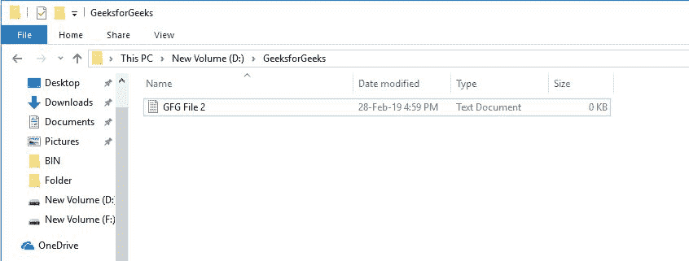

# Perl | rename()函数

> 原文:[https://www.geeksforgeeks.org/perl-rename-function/](https://www.geeksforgeeks.org/perl-rename-function/)

Perl 中的 rename()函数将文件的旧名称重命名为用户给定的新名称。

> **语法:**重命名(旧 _ 文件 _ 路径，新 _ 文件 _ 路径)
> 
> **参数:**
> **旧文件路径:**旧文件路径及其名称
> **新文件路径:**新文件路径及其名称
> 
> **失败时返回**
> 0，成功时返回 1

**示例:**

```perl
#!/usr/bin/perl -w

# Calling the rename() function 
# with required parameters
rename("D:/GeeksforGeeks/GFG File.txt",
       "D:/GeeksforGeeks/GFG File 2.txt") ||
       die ( "Error in renaming" );
```

**输出:**

**原始文件:**


**运行命令:**


**更新文件:**



运行上述代码的步骤:
**步骤 1:** 在系统中的任何位置创建一个文件并复制文件路径。
**步骤 2:** 在上面的代码中提供您的文件的路径，并将其另存为。pl 扩展。
**第三步:**在命令行中以 **perl Filename.pl** 的形式运行上述代码。
**步骤 4:** 文件的名称现在用提供的新名称进行了更改。