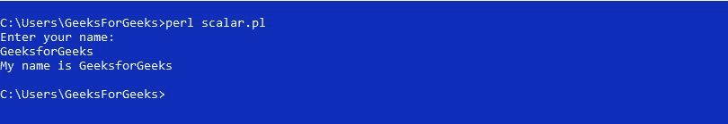

# Perl |标量上下文敏感性

> 原文:[https://www . geesforgeks . org/perl-标量-上下文敏感/](https://www.geeksforgeeks.org/perl-scalar-context-sensitivity/)

**简介:**
在 [Perl](https://www.geeksforgeeks.org/introduction-to-perl/) 中，函数调用、术语和语句具有依赖于其上下文的不一致的解释。Perl 中有两个至关重要的上下文，即[列表上下文](https://www.geeksforgeeks.org/perl-list-context-sensitivity/)和标量上下文。在列表上下文中，Perl 给出了元素列表。但是在标量上下文中，它返回数组中元素的数量。当一个操作符在标量上运行时，它被称为标量上下文。
**注:**

*   每当你给标量变量赋值时，它总是给出标量上下文。
*   在这种情况下，推定是为了获得一个单一的价值。
*   如果将数组赋给标量变量，它将返回其大小。

**Creating a Scalar Context**

标量上下文可以通过使用标量变量、数值运算符等等来生成。

*   **Assignment to a Scalar variable:**
    **Example:**

    ```
    $x = @z;
    ```

    ```
    $x = localtime();
    ```

    ```
    $x = Scalar;
    ```

    在这里，localtime()以人类可读的格式显示时间，而在 List Context 中，这个函数显示时间的数字描述。

*   **Assignment to a single element of an array:**
    **Example:**

    ```
    $a[2] = Scalar;
    ```

    数组的每个元素都是标量。因此，对它们的赋值会生成标量上下文。

*   **创建标量上下文的数值运算符:**
    **示例:**

```
3 + Scalar;
```

```
Scalar + 3;
```

数值运算符可以在其两侧生成标量上下文。

*   **Concatenation creating Scalar Context:**
    **Example:**

    ```
    "GFG" . Scalar;
    ```

    ```
    Scalar . "GFG"
    ```

    从上面的例子可以清楚地看出，连接可以在自身的两侧生成标量上下文。

**示例:**

```
#!/usr/bin/perl 
# Perl program of creating Scalar Context 

# array of elements 
my @CS = ('geeks', 'for', 'geeks', 'articles'); 

# Assignment to a Scalar variable
my $x = @CS;         

# Assignment of a function 
# to a Scalar variable 
# Note: Time displayed here
# will be the GMT
my $y = localtime(); 

# Numerical operator creating
# Scalar Context
my $z = 3 + @CS;

# Displays number of elements
# in an Array
print "$x\n";     

# Displays time stored in array 
# in human readable format
print "$y\n";

# Displays sum of a number
# and Scalar
print "$z\n";

# Concatenation creating 
# Scalar Context
print "The number of elements are: " . @CS
```

**Output:**

```
4
Wed Mar 27 07:01:56 2019
7
The number of elements are: 4

```

**Forcing Scalar Context**

当 Perl 假定一个列表时，必须要求强制标量上下文。因此，在这种情况下，您可以使用**标量()函数**，该函数生成标量上下文，因为该函数通知 Perl 为其参数赋予标量上下文。
**例:**

```
#!/usr/bin/perl 
# Perl program of Forcing Scalar Context 

# array of elements 
my @x = ('geeks', 'for', 'geeks'); 

# Forcing Scalar context to display
# number of elements in an Array
print scalar @x;
print "\n";

# Displaying time in human readable 
# format by forcing Scalar Context
print scalar localtime();         
```

**Output:**

```
3
Sun Mar 17 06:12:53 2019

```

**Arrays in Scalar Context**

为了使用数组激发标量上下文，需要将数组赋给标量变量。
**例:**

```
#!/usr/bin/perl 
# Perl program of Arrays in Scalar Context 

# array of elements 
my @x = ('geeks', 'for', 'geeks'); 

# Assignment of an Array to
# a Scalar variable
my $y =  @x;

# Displays number of elements in
# an Array
print $y;         
```

**Output:**

```
3

```

**Use of if-statement in Scalar Context**

如果 if 语句的条件部分假定一个值，那么这个值就是标量上下文。在下面的程序中，if-语句包含数组，在标量上下文中，数组返回其中的元素数。因此，如果数组是空的，那么它将返回 0。因此，如果作为标量上下文传递给它的数组是空的，if-语句将不会执行。
**节目 1:**

```
#!/usr/bin/perl 

# Program of if-statement in Scalar Context 
use strict; 
use warnings; 
use 5.010; 

# Array with no elements
my @w = (); 

# Statement within 'if' will be executed 
# only if the array is not empty 
if (@w) 
{ 
    print "Geeks"; 
} 
```

**Output:**

```
No Output

```

这里，没有打印任何内容，因为所述数组是空的。因此，代码不显示 if 语句的内容。

**程序 2:**

```
#!/usr/bin/perl 

# Program of if-statement in Scalar Context 
use strict; 
use warnings; 
use 5.010; 

# An Array of elements
my @w = ('G', 'f', 'G'); 

# Statement within 'if' will be executed 
# only if the array is not empty 
if (@w) 
{ 
    print "There are some elements in the Array"; 
} 
```

**Output:**

```
There are some elements in the Array

```

这里，上面陈述的数组不是空的，所以打印 if 语句的内容。

**Reading in SCALAR Context**

为了将读线运算符(即**<【STDIN】>**)置于标量上下文中，需要将该运算符指定给标量变量。
**例:**

```
#!/usr/bin/perl 
# Program to Read input from user
use strict; 
use 5.010; 

# Asking the user to provide input  
print "Enter your name:\n"; 

# Getting input from user  
my $y = <STDIN>; 

# Printing the required output 
print "My name is $y\n";
```

**输出:**

上述程序使用**<【STDIN】>**接受用户的输入，并将其存储在标量变量中。此外，使用标量变量打印用户提供的输入。