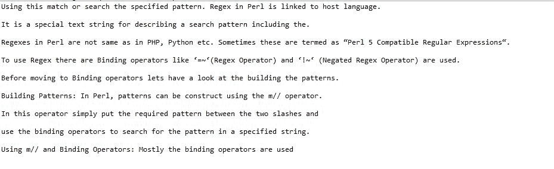

# Perl |使用正则表达式在文件中搜索

> 原文:[https://www . geesforgeks . org/perl-在文件中搜索-使用-regex/](https://www.geeksforgeeks.org/perl-searching-in-a-file-using-regex/)

**先决条件:** [Perl |正则表达式](https://www.geeksforgeeks.org/perl-regular-expressions/)

**正则表达式** (Regex 或 Regexp 或 RE)在 [Perl](https://www.geeksforgeeks.org/introduction-to-perl/) 中是一个特殊的文本字符串，用于描述给定文本中的搜索模式。Perl 中的 Regex 链接到宿主语言，与 PHP、Python 等中的 regex 不一样。有时这些被称为“Perl 5 兼容正则表达式”。为了使用正则表达式，使用了像 `**=~**`(正则表达式运算符)和 `**!~**`(反正则表达式运算符)这样的绑定运算符。
这些 Binding regex 运算符用于匹配正则表达式中的字符串。语句的左侧将包含一个字符串，该字符串将与包含指定模式的右侧相匹配。否定正则表达式运算符检查字符串是否不等于右侧指定的正则表达式。

Regex 操作符有助于在文件中搜索特定的单词或一组单词。这可以根据用户的要求以多种方式完成。在 Perl 中搜索遵循的标准格式是，首先以读取模式打开文件，然后逐行进一步读取文件，然后在每行中查找所需的字符串或字符串组。当找到所需的匹配时，搜索表达式后面的语句将决定下一步如何处理匹配的字符串，它可以添加到用户指定的任何其他文件中，也可以简单地打印在控制台上。

在为匹配所需字符串和文件而创建的正则表达式中，可以有多种方法来搜索所需字符串:

### 常规搜索:

这是编写正则表达式的基本模式，该表达式在指定文件中查找所需的字符串。下面是这样一个正则表达式的语法:

```perl
$String =~ /the/
```

该表达式将在文件中搜索包含带有字母“*”的单词的行，并将该单词存储在变量`$String`中。此外，这个变量的值可以复制到一个文件中，或者简单地打印在控制台上。*

***示例:***

```perl
*use strict;
use warnings;

sub main
{
    my $file = 'C:\Users\GeeksForGeeks\GFG.txt';
    open(FH, $file) or die("File $file not found");

    while(my $String = <FH>)
    {
        if($String =~ /the/)
        {
            print "$String \n";
        }
    }
    close(FH);
}
main();*
```

***输出:**

可以看出，上面的搜索还会选择包含“the”的单词。为了避免出现这种情况，可以通过以下方式更改正则表达式:*

```perl
*`**$String =~ / the /**`*
```

*通过在需要搜索的单词前后提供空格，被搜索的单词从两端被隔离，并且在搜索过程中不返回包含该单词作为其一部分的单词。这将解决搜索不需要的额外单词的问题。但是，这将导致在请求的搜索词之后立即排除包含逗号或句号的单词。
为了避免这种情况，也有其他方法有助于将搜索限制到特定的单词，其中一种方法是使用单词边界。*

### *在正则表达式搜索中使用单词边界:*

*如上例所示，常规搜索会返回包含搜索到的单词作为其一部分的额外单词，或者如果在所需单词前后用空格搜索，则排除一些单词。为了避免这种情况，使用了由“`\b`”表示的单词边界。*

```perl
*`$String =~ /\bthe\b/;`*
```

*这将限制包含所请求单词的单词作为其一部分进行搜索，并且不会排除以逗号或句号结尾的单词。*

***示例:***

```perl
*use strict;
use warnings;

sub main
{
    my $file = 'C:\Users\GeeksForGeeks\GFG.txt';
    open(FH, $file) or die("File $file not found");

    while(my $String = <FH>)
    {
        if($String =~ /\bthe\b/)
        {
            print "$String \n";
        }
    }
    close(FH);
}
main();*
```

***输出:**

从上面给出的例子中可以看出，以句号结尾的单词被包括在搜索中，但是包含被搜索单词作为一部分的单词被排除。因此，单词边界可以帮助克服常规搜索方法中产生的问题。*

*如果有一种情况需要找到以特定字符开头或结尾或两者都有的单词，该怎么办？那么使用常规搜索或单词边界就不能做到这一点。对于这种情况，Perl 允许在正则表达式中使用通配符。*

### *通配符在正则表达式中的使用:*

*Perl 允许使用正则表达式中的通配符在给定文件中搜索一组特定的单词或遵循特定模式的单词。通配符是放置在正则表达式中的“点”以及需要搜索的单词。这些通配符允许正则表达式搜索遵循给定模式的所有相关单词，并将显示相同的内容。通配符有助于减少搜索具有共同字母模式的各种不同单词的迭代次数。*

```perl
*`$String =~ /t..s/;`*
```

*上面的模式将搜索所有以 t 开头、s 结尾、中间有两个字母/字符的单词。*

***示例:***

```perl
*use strict;
use warnings;

sub main
{
    my $file = 'C:\Users\GeeksForGeeks\GFG.txt';
    open(FH, $file) or die("File $file not found");

    while(my $String = <FH>)
    {
        if($String =~ /t..s/)
        {
            print "$String \n";
        }
    }
    close(FH);
}
main();*
```

***输出:**

以上代码包含给定模式中指定的所有单词。*

*在这种打印搜索到的单词的方法中，包含该单词的整行都会被打印出来，这使得很难准确地找出用户搜索的是什么单词。为了避免这种混乱，我们只能打印搜索到的单词，而不能打印整个句子。这是通过使用括号将搜索到的模式分组来完成的。要打印这组单词，需要使用`**$number**`变量。
`**$number variables**` 是正则表达式中形成的捕获组的最后一次成功匹配的匹配。例如，如果正则表达式中有多个分组，那么 `$1` 将打印匹配第一个分组的单词，类似地，`$2` 将匹配第二个分组，以此类推。*

*下面给出的是上面的程序，它使用$number 变量进行了转换，只显示搜索到的单词，而不是整个句子:*

```perl
*use strict;
use warnings;

sub main
{
    my $file = 'C:\Users\GeeksForGeeks\GFG.txt';
    open(FH, $file) or die("File $file not found");

    while(my $String = <FH>)
    {
        if($String =~ /(t..s)/)
        {
            print "$1 \n";
        }
    }
    close(FH);
}
main();*
```

***输出:**
*