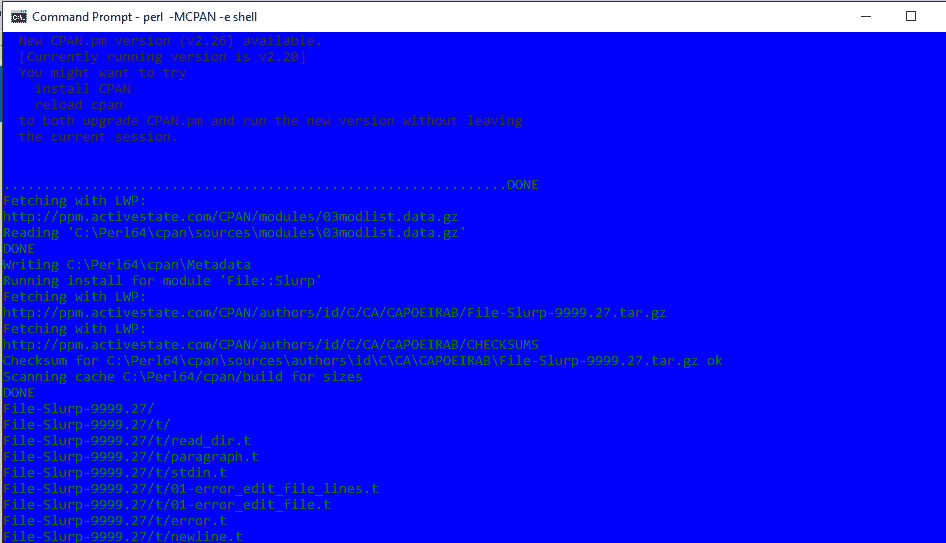

# Perl |思乐普模块

> 原文:[https://www.geeksforgeeks.org/perl-slurp-module/](https://www.geeksforgeeks.org/perl-slurp-module/)

**`File::Slurp`** 模块用于读取文件内容并将其存储为字符串。这是一种读取/写入/修改完整文件的简单有效的方法。就像它的名字一样，它允许你通过一个简单的调用来读取或写入整个文件。
通过将这个模块导入到你的程序中，用户可以实现 read_file、read_text、write_file 等功能。向/从文件中读写内容。

**安装`File::Slurp`模块:**
要使用这个模块，需要先将其添加到您的 Perl 语言包中。这可以通过在您的 Perl 终端中使用以下命令并安装所需的模块来完成。

**第一步:**打开终端，运行以下命令:

```perl
perl -MCPAN -e shell
```


进入 cpan 外壳后，按照下一步安装 File::Slurp 模块。
**步骤 2:** 运行以下命令安装模块:

```perl
install File::Slurp
```


这将安装 File::Slurp 模块。
**第三步:**键入并运行‘q’命令，从 **cpan >** 提示符退出。

**`read_file`函数在 slurpp 中:**
File::slurpp 的 read_file 函数读取文件名为的文件的全部内容，并将其作为字符串返回。但是，不鼓励使用 File::Slurp，因为它几乎没有可能在编译过程中导致问题的编码层问题。文件::思乐普旨在成为避免上述问题的替代方案。

> **语法:**
> 使用 File::Slurp；
> my $ text = read _ file($ filename)；
> 
> **返回:**返回一个字符串。

思乐普中的 **`read_text`函数:**
File::思乐普的 read_text 函数接受一个可选的编码参数(如果有的话)，如果你请求的话可以自动解码 CRLF 行尾(对于 Windows 文件)。

> **语法:**
> 使用 File::Slurper；
> my $ content = read _ text($ filename)；
> 
> **返回:**返回一个字符串。

**注意:**
CRLF 换行符用于标记文本文件中的换行符(Windows 换行符类型)。

**`write_file`函数在 slurpp:**
File::slurpp 的 write_file 函数是利用 File::slurpp 模块一次性写入所有文件。它在标量变量的帮助下写入文件，该变量包含由 read_file 函数读取的另一个文件的内容。

> **语法:**
> 使用 File::Slurp；
> write_file($filename，$ content)；
> 
> **返回:**不返回值，只是将内容写入文件。

**示例 1:** 使用标量存储文件内容

```perl
# Perl code to illustrate the slurp function
use File::Slurp;

# read the whole file into a scalar
my $content = read_file('C:\Users\GeeksForGeeks\GFG_Slurp.txt');

# write out a whole file from a scalar
write_file('C:\Users\GeeksForGeeks\Copyof_GFG_Slurp.txt', $content);
```

**输出:**


**解释:**
在上面的 Perl 代码中，最初，我们使用 slurp 函数读取一个名为`**GFG_Slurp.txt**`的文件，该文件包含一些文本行作为名为`**$content**`的标量变量的输入，然后将该文件的内容作为单个字符串写入另一个文件`**Copyof_GFG_Slurp.txt**`。

**示例 2:** 使用数组存储文件内容

```perl
# perl code to illustrate the slurp function
use File::Slurp;

# read the whole file into a scalar
my @lines = read_file('C:\Users\GeeksForGeeks\GFG_Slurp2.txt');

# write out a whole file from a scalar
write_file('C:\Users\GeeksForGeeks\Copyof_GFG_Slurp2.txt', @lines);
```

**输出:**


**解释:**
在上面的 Perl 代码中，最初，我们使用 slurp 函数读取一个名为`**GFG_Slurp2.txt**`的文件，该文件包含一个文本行数组作为输入到名为`**@lines**`的数组变量中，然后将整个文件的内容作为单个字符串写入名为`**Copyof_GFG_Slurp2.txt**`的文件中。

**示例 3:** 创建一个使用 slurp 方法的函数

```perl
# Perl code to illustrate the slurp function
use strict;
use warnings;
use File::Slurp;

# calling user defined function
get_a_string();

sub get_a_string
{
  # read entire file into a scalar
  my $gfg_str = read_file('C:\Users\GeeksForGeeks\GFG_User_Slurp.txt');

  # write entire file from a scalar
  write_file('C:\Users\GeeksForGeeks\Copyof_GFG_User_Slurp.txt', $gfg_str);
}
```

**输出:**


**说明:**

在上面的 Perl 代码中，严格和警告允许用户更自由地输入代码，并更快地发现错误，如变量名中的错别字等。我们调用了一个名为 get_a_string 的用户定义函数，该函数依次执行 slurp 函数..，它读取包含一些文本行的文件作为名为 gfg_str 的变量的输入，然后将整个文件的内容作为单个字符串写入文件。