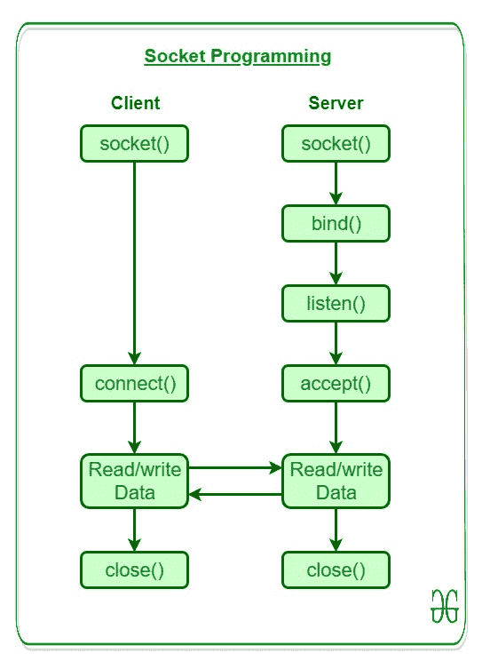
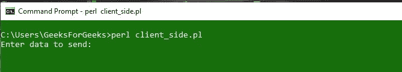

# Perl | Socket 编程

> 原文:[https://www.geeksforgeeks.org/perl-socket-programming/](https://www.geeksforgeeks.org/perl-socket-programming/)

[Perl](https://www.geeksforgeeks.org/introduction-to-perl/) 中的 Socket 编程是连接网络上两个节点相互通信的一种方式。基本上，这是一个单向的客户机和服务器设置，客户机连接，向服务器发送消息，服务器使用套接字连接显示消息。一个套接字(节点)监听某个 IP 的特定端口，而另一个套接字则与另一个套接字建立连接。服务器形成侦听器套接字，而客户端则连接到服务器。在深入研究服务器和客户端代码之前，强烈建议先通过 [TCP/IP](https://www.geeksforgeeks.org/computer-network-tcpip-model/) 模型。

网络上的任何计算机系统都需要一个本地端口来通过互联网传输数据。这些数据通过使用其 IP 地址被定向到指定的系统。每个系统都通过为相应进程指定的端口在网络上接收和发送这些数据。例如，端口 80 是接收服务器发送的信息的默认端口。这个端口不必总是相同的，它也可以由用户决定。
因此，套接字是一个 IP 地址和一个端口，它使网络连接能够向其他网络或系统发送/接收信息。

通过运行 Perl 脚本在两个不同的控制台上创建一个服务器和一个客户端，然后通过安全连接在两者之间传输数据，可以更好地理解套接字编程。


上图说明了在 Socket 编程中运行服务器端和客户端脚本必须进行的调用。

### 服务器端编程的阶段

要在套接字编程中创建服务器，需要逐步执行以下步骤:

**- >** 使用`**socket()**`调用功能创建插座。Perl 提供了一个预定义的模块`**Socket.pm**`，需要使用**使用**pragma 将其包含在代码中。

> **使用 Socket**

本模块将帮助在服务器端创建套接字

**- >** **`bind()`** 调用用于绑定带有端口号的套接字。没有端口，插座就没有用了。服务器使用这个 **`bind()`** 函数为一个套接字分配一个端口。

> **绑定(套接字，端口 _ 地址)**

**- >** **`listen()`** 呼叫是为了使端口能够等待任何传入的请求。此调用由服务器完成，以提供服务器允许的连接请求的限制。

> **听音(插座，大小)**

这里，大小用于传递请求限制。

**- >** **`accept()`** 呼叫用于向`**access()**`功能发出请求以接受呼入连接。

> **接受(new_socket，socket)**

如果 **`access()`** 调用成功，则返回一个新的套接字，用于将来与相应客户端的连接。

### 客户端编程的阶段

要在套接字编程中创建客户端，需要逐步执行以下步骤:

**- >** 使用 **`socket()`** 调用功能创建插座。Perl 提供了一个预定义的模块`**Socket.pm**`，需要使用**使用**pragma 将其包含在代码中。

> **使用 Socket**

该模块将帮助在客户端创建套接字

**- >** **`connect()`** 调用用于通过使用特定的地址将套接字与服务器连接起来。

> **连接(插座、地址)**

这里，地址类似于`**bind()**`调用，除了它包含远程服务器的 IP 地址。

### 套接字编程示例:

**要为服务器创建运行的脚本:**

```
#!/usr/bin/perl -w  
use IO::Socket;   
use strict;   
use warnings;   

my $socket = new IO::Socket::INET (   
LocalHost => 'localhost',   
LocalPort => '6666',   
Proto => 'tcp',   
Listen => 1,   
Reuse => 1,   
);   

die "Could not create socket: $!n" unless $socket;   

print "Waiting for data from the client end\n";   
my $new_socket = $socket->accept();   
while(<$new_socket>) 
{   
    print $_;   
}   

close($socket);  
```

将以上脚本保存为`**server_side.pl**`
**输出:**


**要为客户端创建运行的脚本:**

```
use strict;   
use warnings;   
use IO::Socket;   

my $socket = new IO::Socket::INET (   
PeerAddr => 'localhost',   
PeerPort => '6666',   
Proto => 'tcp',   
);   

die "Could not create socket: $!n" unless $socket;

print "Enter data to send:\n";  
my $data = <STDIN>;  
chomp $data;  
print $socket "Data received from user: '$data'\n";  

close($socket);  
```

将以上脚本保存为`**Client_side.pl**`
**输出:**


**为插座编程提供测试输入:**

**客户端:**


**服务器端:**
