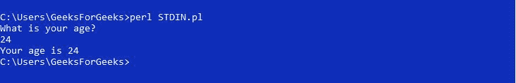

# 标量和列表上下文中的 Perl | STDIN

> 原文:[https://www . geesforgeks . org/perl-stdin-in-scalar-and-list-context/](https://www.geeksforgeeks.org/perl-stdin-in-scalar-and-list-context/)

[Perl](https://www.geeksforgeeks.org/introduction-to-perl/) 中的 STDIN 用于从键盘获取输入，除非其工作已经被用户重新定义。

> **语法:** < STDIN >

**STDIN in Scalar Context**

为了从键盘上获取输入，在 Perl 中使用的是运算符。该操作符读取通过键盘输入的一行，以及对应于我们在输入后按下的回车键的换行符。

**示例:**

```perl
# Asking user for Input
print "What is your age?\n";

# Getting an age from the user
$age = <STDIN>;

# Removes new line from the input
chomp $age;

# Printing the value entered by user
print "Your age is ", $age;
```

**输出:**



所以$age 包含用户给出的输入以及新的行字符。为了删除新行，使用 chomp 函数从字符串末尾删除“\n”。

**STDIN in List Context**

当 STDIN 与列表上下文一起使用时，它将多个值作为键盘的输入。按回车键指示列表中的单个元素。为了指示输入的结束，在 Linux 系统中按下 Ctrl-D，而在 Windows 系统中按下 Ctrl-Z。
下面的例子展示了 STDIN 在列表上下文中的使用。
T3】例:

```perl
# Get a city name from the user 
print "Enter the cities you have visited last year... ";
print "<Ctrl>-D to Terminate \n";
@city = <STDIN>;

# Removes new line appended at 
# the end of every input
chomp @city;

# Print the city names
print "\nCities visited by you are: \n@city ";
```

**输出:**


以上程序工作原理如下:
**第一步:**从用户处获取列表输入，中间用回车符隔开。
**第二步:**当按下 Ctrl-D 时，它指示输入的结束，因此，Perl 将所有内容分配给@city 数组。
**步骤 3:** 使用 chomp 功能从所有输入中删除新行。
**第四步:**打印输入的城市名称。