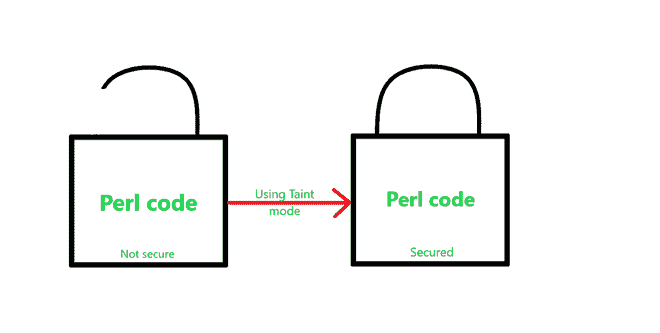

# Perl–污点()方法

> 原文:[https://www.geeksforgeeks.org/perl-taint-method/](https://www.geeksforgeeks.org/perl-taint-method/)

在 [Perl 中，](https://www.geeksforgeeks.org/introduction-to-perl/)污点模式是使我们的代码更加安全的一种方式。这使得我们的程序对从外部来源接收的数据更加大惊小怪。外部来源是指用户、文件系统、环境、区域信息和一些系统调用。污点模式是为安全性很重要的情况而创建的，比如编写运行 root 或 CGI 脚本的 Perl 程序。人们应该总是在他们的 CGI 脚本中使用污点模式。
某些函数意外导致错误数据问题。确保程序正在打开我们想要打开的文件，而不是像恶意用户提供的命令这样的东西，这符合我们的利益。



#### 污点()方法的使用

要打开污点模式，我们只需在哈斯邦线中使用 ***-T 标志*** 。

```perl
#!/usr/bin/perl -wT 

```

污点模式用于跟踪来自用户的数据，避免用它做任何不安全的事情。当它被启用时，每个变量都被 Perl 监控，以检查它是否被污染。受污染的数据是来自代码外部的任何数据。
因为它涵盖了从 **STDIN** 读取的任何内容以及所有环境变量，所以它包含了来自服务器的 CGI 脚本接收器的所有内容。从而防止 Perl 允许任何用户输入的值被用于影响外部文件的任何 Perl 命令。
污点模式不允许来自应用程序外部的数据影响应用程序外部的任何东西。

**污点()**是**标量::Util** 模块的一个函数，可用于检查变量是否被污染，以及使用哪个变量会触发“不安全依赖”消息。

#### 污点的来源()

每当给定系统出现安全漏洞时，首先检查程序的攻击面。攻击面是程序中暴露给攻击者的部分。
*污点源*是程序中从潜在风险源读取数据的位置，包括环境变量、数据、文件、网络服务等。

攻击者可以使用这些未经验证的通道来触发安全漏洞或导致问题崩溃。因此，为了避免这种情况，会进行污点分析。通过消除可利用的攻击面，这是降低风险因素的有效方法。

#### 污点的去除()

如果没有一种方法来解开我们的数据，污点模式就会受到如此多的限制。但是，当然，人们不想在没有检查安全的情况下解开数据。幸运的是，在 Perl 中有一个命令允许我们完成这两个任务。Perl 不允许包含污点值的表达式计算为未污点值。
因此，取消污点变量的唯一方法是对其执行模式匹配操作，然后提取匹配的子字符串。如果我们将一个变量与一个正则表达式进行匹配，那么与匹配的括号相对应的匹配变量是没有污点的(比如$1、$2 等)。

例如:如果我们希望一个变量包含一个电子邮件地址，那么我们可以这样提取一个地址的无污点副本:

## Perl 语言

```perl
$mail_address=~/(\S+)\@([\w.-]+)/;
$untainted_address = "$1\@$2";
```

**解释:**在上面的例子中，第一个圆括号包围(\w{1}[\w-。]*)匹配一个或多个单词字符、破折号和句点，在它之前至少有一个不包含破折号或句点的单词字符。括号使得第一个匹配在 Perl 中被分配给$1。
然后，匹配一个@符号。最后，第二组括号([\w-。]+)匹配更多的单词字符、破折号和句点。第二场比赛分到$2。
因此，当正则表达式成功时，$1 将等于电子邮件地址的用户名部分，$2 将等于域部分。
Perl 认为这些变量是特殊的，因为 Perl 基本上认为，由于这些变量来自我们已经设置的正则表达式，我们已经明确检查了该正则表达式中数据的有效性。因此，1 美元和 2 美元不被认为是有污点的。

#### 从环境中去除污点()

什么数据被污染的问题取决于执行环境。例如，一个数据库的数据可能被认为是污染的，也可能不是。Perl 有一个 DBI 模块，它有可选的*属性，当设置该属性时，从数据库接收的所有数据都被认为是有污点的。类似地，有些特定的操作集不应该在受污染的数据上执行，这完全取决于执行环境。*

*默认情况下，从模块中导入符号会打开污点检查。如果希望在不需要污点检查(从环境中去除污点)的情况下使用这个模块，我们可以通过以下方式实现:*

*   *使用*(允许不带-T 运行)。**

```perl
*# allow to run without -T
use Taint qw(allow_no_taint);    

# default import list
use Taint;* 
```

*   *不通过显式传递空导入列表来导入任何符号。*

```perl
*# importing no symbols
use Taint ();* 
```

*显示污点模式实现的基本程序:*

## *Perl 语言*

```perl
*# Showing how a variable assigned to
# a tainted value gets tainted itself too:

#!/usr/bin/perl -T

my $arg = $ARGV[0];
my $file = "/home/foo/$arg";

open FOO, ">$file" or die $!;
print FOO "Yay\n";

close FOO;
exit 0;*
```

*此程序将失败，并出现以下错误:*

```perl
*Insecure dependency in open while running with -T switch at ./test.pl line 9.* 
```