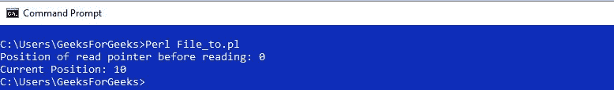

# Perl | tell()函数

> 原文:[https://www.geeksforgeeks.org/perl-tell-function/](https://www.geeksforgeeks.org/perl-tell-function/)

[Perl](https://www.geeksforgeeks.org/introduction-to-perl/) 中的 tell()函数用于通过使用文件句柄获取文件中读取指针的位置。如果没有传递文件句柄，则返回最近访问的文件中的位置。

> **语法:**告诉(文件句柄)
> 
> **参数:**
> **要访问文件的文件句柄:**文件句柄。
> 
> **返回:**读指针的当前位置

**例 1:**

```perl
#!/usr/bin/perl 

# Opening a File in Read-only mode 
open(fh, "<", "Hello.txt"); 

$position = tell(fh);
print("Position of read pointer before reading: $position");

# Reading first 10 characters from the file
for($i = 0; $i < 10; $i++)
{
    $ch = getc(fh);
}

$position = tell(fh);

# Current position of the read pointer
print("\nCurrent Position: $position");

# Closing the File 
close(fh); 
```

**输出:**


**例 2:**

```perl
#!/usr/bin/perl 

# Opening a File in Read-only mode 
open(fh, "<", "Hello.txt"); 

$position = tell(fh);
print("Position of read pointer before reading: $position\n");

# Printing First 10 Characters
print("First ten characters are: ");

# Reading and printing first 
# 10 characters from the file
for($i = 0; $i < 10; $i++)
{
    $ch = getc(fh);
    print" $ch";
}

$position = tell(fh);

# Current position of the read pointer
print("\nCurrent Position: $position");

# Closing the File 
close(fh); 
```

**输出:**
