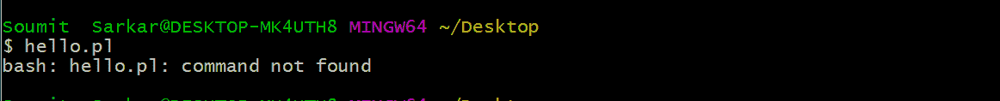

# Perl |使用散列棒或 Shebang 线

> 原文:[https://www . geesforgeks . org/perl-use-of-hash-bang-or-shebang-line/](https://www.geeksforgeeks.org/perl-use-of-hash-bang-or-shebang-line/)

实用提取和报告语言或 [Perl](https://www.geeksforgeeks.org/introduction-to-perl/) 是一种基于解释器的语言。当我们在类似 Unix 的系统(如 Linux 和 Mac OSX)上执行 Perl 脚本时，Hash-bangs 或 shebangs 非常有用。Hashbang 行是 Perl 程序的第一行，也是 Perl 二进制文件的路径。它允许直接调用 Perl 脚本，而无需将文件作为参数传递给 Perl。Perl 中的一个 Hashbang 行看起来像:

```
#!/usr/bin/perl
```

一个 Hashbang 行之所以这么叫是因为它以一个 **Hash(#)** 和一个 **bang(！)**。Perl 中的一个散列行在 Perl 代码中非常重要。现在，让我们开始使用这条哈斯邦线。

**示例:**假设我们有一个 Perl 的 hello world 程序脚本，我们将在带有终端的 Linux 系统上执行该脚本。

```
use strict;
use warnings;

print "Hello World\n";
```

现在，我们将用名称 **hello.pl** 保存它，在终端中，我们将通过–

```
$ perl hello.pl

```

**输出:**

这里，在上面的代码中，终端首先运行 Perl，然后 Perl 被要求运行代码脚本。如果运行代码脚本时没有首先调用 Perl，那么就会出现错误。
尝试运行如下所示的代码:

```
$ hello.pl

```

**输出:**

在这里，我们使用的 shell，试图解释文件中的命令。但是在 Linux/Unix 中找不到**打印**的命令。因此，需要通知 shell 这是一个 Perl 脚本。这就是哈斯邦概念开始发挥作用的地方。哈斯邦将脚本通知给终端。
但是，在执行这段代码之前，需要设置 shell 的路径，将当前目录添加到现有目录中。这可以通过执行以下命令来完成:

```
$ PATH = $PATH:$(pwd)

```

这会将当前工作目录追加到**路径环境变量**中的目录列表中。
接下来，需要添加哈希棒线 **#！/usr/bin/perl** 在 perl 脚本文件 **hello.pl** 中。这一行总是添加在代码的开头，即代码脚本的第一行是 Hashbang 行。

```
#!/usr/bin/perl
use strict;
use warnings;

print "Hello World\n";
```

如果上面的代码作为 **$ hello.pl** 运行，没有先执行 Perl，那么输出将是:

上面的代码工作正常，没有因为 Hashbang 行 **#！/usr/bin/perl** 作为脚本的第一行添加。

当脚本被执行时，它在当前的 shell 环境中运行。如果脚本以一个 hash 和一个 bang (hash-bang)开始 **#！**然后 shell 将运行执行路径位于 hash-bang 行(在本例中为 ***/usr/bin/perl*** )的应用程序，这是 perl 编译器-解释器的标准位置。因此，hash-bang 行保存了到 Perl 编译器-解释器的路径。
现在，当文件中没有 hash-bang 行并且我们试图在不显式运行 Perl 的情况下执行它时，就会出现错误。外壳假设脚本是在 **Bash** 中编写的，因此试图相应地执行它，从而导致错误。