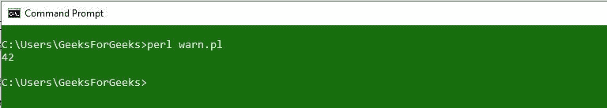
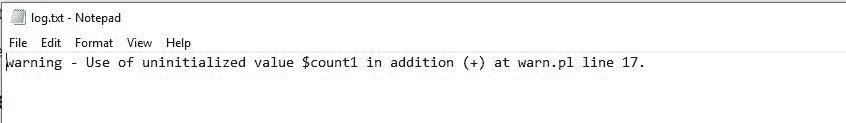
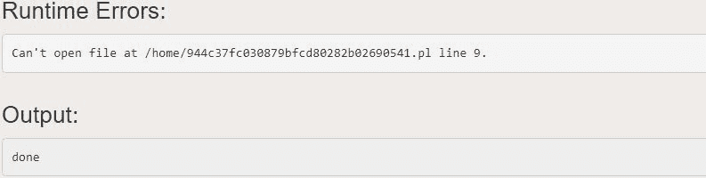
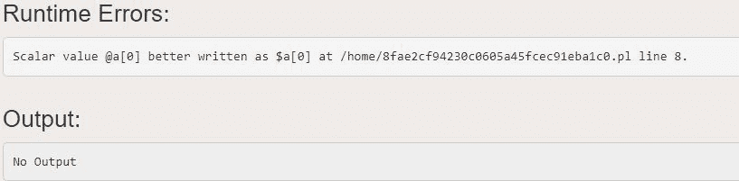

# Perl |警告以及如何处理它们

> 原文:[https://www . geesforgeks . org/perl-警告-以及如何处理它们/](https://www.geeksforgeeks.org/perl-warnings-and-how-to-handle-them/)

[Perl 中的警告](https://www.geeksforgeeks.org/introduction-to-perl/)是 Perl 编程中最常用的 Pragma，用于捕捉‘不安全代码’。pragma 是 Perl 包中的一个特定模块，它对 Perl 的编译时或运行时行为的某些功能进行控制，这是严格的或警告的。第一行是这样的，

```perl
use warnings;
```

当使用警告 pragma 时，编译器将检查错误，对代码发出警告，并禁止某些编程结构和技术。每当出现可能的印刷错误时，这个 pragma 都会发出警告，并寻找可能的问题。程序执行过程中可能会出现许多问题，但是**“警告”** pragma 主要查找最常见的脚本错误和语法错误。

> **注意:**这个“**使用警告**”的 pragma 是在 Perl 5.6 及更高版本中引入的，对于旧版本，可以通过使用 shebang/hashbang 行中的**“-w】**:
> **#！/usr/local/bin/perl -w**

**使用严格的** pragma 的工作方式也与**使用警告**相同，但唯一的区别是**严格的** pragma 会在发现错误时中止程序的执行，而**警告** pragma 只会提供警告，不会中止执行。

**示例:**

## Perl 语言

```perl
#!/usr/bin/perl
use strict;
use warnings;

local $SIG{__WARN__} = sub
{
    my $msz = shift;
    log1('warning', $msz);
};

my $count1;
count();
print "$count1\n";

sub count
{
    $count1 = $count1 + 42;
}

sub log1
{
    my ($level, $msg) = @_;
    if (open my $out, '>>', 'log.txt')
    {
        chomp $msg;
        print $out "$level - $msg\n";
    }
}
```

**输出:**



**存储警告的日志文件:**



### 如何生成警告

在 [Perl](https://www.geeksforgeeks.org/introduction-to-perl/) 中的警告可以通过使用 Perl 中的预定义函数**【警告】**来创建。
Perl 中的一个 **warn** 函数会为错误生成一条警告消息，但不会退出脚本。脚本将继续执行剩余的代码。因此，当只需要打印一条警告信息，然后继续程序的其余部分时，使用**警告**功能。

## Perl 语言

```perl
#!/usr/bin/perl
use warnings;  

# Assigning variable to the file
my $filename = 'Hello.txt'; 

# Opening the file using open function
open(my $fh, '>', $filename) or warn "Can't open file";    
print "done\n"; 
```

**输出:**



### 启用和禁用警告

可以通过在代码中使用**‘使用警告’**pragma 来启用警告。但是，这个 pragma 只能在较新版本的 Perl 中使用，即 5.6 版或更高版本。对于旧版本，-w 用于启用警告。这个-w 是在 Hashbang 行中添加的:

```perl
#!/usr/local/bin/perl -w
```

虽然这可以用来启用警告，但是这个“-w”在整个程序中启用警告，甚至在由其他人编写和维护的外部模块中。

这个**警告** pragma 也可以用**替换使用现代::Perl** 。此方法在词法范围内启用警告。

通过在范围内使用**“无警告”** pragma 以及参数列表，可以选择性地禁用警告。如果未提供参数列表，则此 pragma 将禁用该范围内的所有警告。

**示例:**

## Perl 语言

```perl
use warnings;
my @a;
{
    no warnings;
    my $b = @a[0];
}

my $c = @a[0];
```



在上面的代码中，标量值的赋值为$c 而不是$b 的赋值产生了错误，因为在块中没有使用警告。

### 创建您自己的警告

[Perl](https://www.geeksforgeeks.org/introduction-to-perl/) 允许创建和注册您自己的警告，以便其他用户可以在词法范围内轻松启用和禁用它们。这可以通过使用预定义的 pragma**‘警告::注册’**来完成。

```perl
package Geeks::Perl_program;

use warnings::register;
```

上面给出的语法将创建一个新的警告类别，以包 **Geeks::Perl_program** 命名。现在这个警告类别已经创建，可以使用**使用警告“极客::Perl _ program”**启用，也可以使用**无警告“极客::Perl _ program”**进一步禁用。
要检查调用者的词法范围是否启用了警告类别，可以使用**警告::enabled()** 。另一个 pragma **警告::warnif()** 只有在警告已经生效的情况下，才能用来产生警告。

**示例:**

## Perl 语言

```perl
#!/usr/bin/perl
package Geeks::Perl_program;

use warnings::register;

sub import
{
    warnings::warnif( 'deprecated',
        'empty imports from ' . __PACKAGE__ .
        ' are now deprecated' )
    unless @_;
}
```

以上示例在不推荐使用的类别中产生警告。