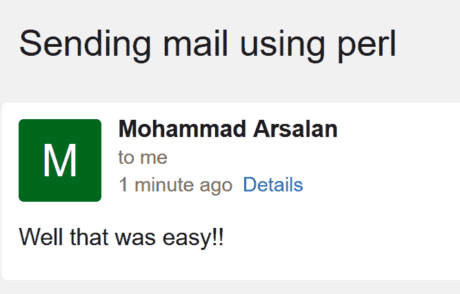

# 使用 Perl 发送电子邮件

> 原文:[https://www.geeksforgeeks.org/sending-an-email-using-perl/](https://www.geeksforgeeks.org/sending-an-email-using-perl/)

[Perl](https://www.geeksforgeeks.org/introduction-to-perl/) 允许其用户使用 Perl 代码脚本发送邮件。使用 Perl 发送电子邮件有多种方式。这些电子邮件可以是简单的电子邮件、带有附件的电子邮件、HTML 格式的电子邮件、具有多个接收者的电子邮件等..Perl 也提供了一些模块来做同样的事情。在本文中，我们将介绍一些使用 Perl 脚本发送电子邮件的方法。

#### 发送邮件实用程序

首先，我们将讨论 Sendmail 实用程序。你不能指望用它就能获得很高的交货率。有时电子邮件会跳过收件箱。对于 Linux/Unix，Sendmail 设置起来既快捷又简单。对于 Windows 和其他设备，您需要考虑替代方法。

##### 发送简单邮件

```
#!/usr/bin/perl

# Details for email
$to = 'user1@mail.abc';
$from = 'user2@mail.abc';
$subject = 'Sending mail using perl';
$message = 'Well that was easy!!';

open(MAIL, "|/usr/sbin/sendmail -t");

# Email Header
print MAIL "To: $to\n";
print MAIL "From: $from\n";
print MAIL "Subject: $subject\n\n";

# Email Body
print MAIL $message;

$result = close(MAIL);
if($result) 
{ 
    print "Email Sent, Bro!\n";
} 
else
{ 
    print "There was a problem, Bro!\n";
}
```

只需添加您和发件人的电子邮件 id，邮件将成功发送，您将看到快速结果。如果没有，请确保 sendmail 在您的计算机上配置正确，并且收件人的电子邮件服务不会阻止来自您的 IP 地址的电子邮件。


##### HTML 格式的电子邮件

如果用户想向接收者发送 html 格式的文本怎么办？在这种情况下，只需在 perl 脚本中添加以下代码作为$message 变量:

```
$message = '<h1>H1 is the main heading</h1><p></p>';
```

上面的代码将按照 html 语法格式化您的邮件。您可以以所需的方式使用 html 的所有标签。

##### 添加抄送和密件抄送字段

您也可以在邮件标题中添加抄送和密件抄送字段。在您的 Perl 脚本中添加以下变量:

```
$cc = 'user1@mail.abc, user2@mail.abc, user3@mail.abc';
$bcc = 'user4@mail.abc';

```

##### 添加附件

给邮件添加附件是可能的，但它有点复杂。使用这个模块并添加大文件可能是一个糟糕的主意，但是您可以使用小文件。

> **注意:**在运行下面的代码之前，请确保已经安装了 Mail::Sendmail 模块。

```
use MIME::QuotedPrint;
use MIME::Base64;
use Mail::Sendmail;
%mail = ( from => 'user1@mail.abc',
          to => 'user2@mail.abc', 
          subject => 'Sending mail using perl');

$boundary = "====" . time() . "====";
$mail{'content-type'} = "multipart/mixed; boundary=\"$boundary\"";

$message = encode_qp( "Well that was easy!!" );

# This is the perl executable
$file = $^X; 

open (F, $file) or die "Cannot read $file: $!";
binmode F; undef $/;
$mail{body} = encode_base64(<F>);
close F;

$boundary = '--'.$boundary;
$mail{body} = <<END_OF_BODY;
$boundary
Content-Type: text/plain; charset="iso-8859-1"
Content-Transfer-Encoding: quoted-printable

$message
$boundary
Content-Type: application/octet-stream; name="$^X"
Content-Transfer-Encoding: base64
Content-Disposition: attachment; filename="File_Name.pdf"

$mail{body}
$boundary--
END_OF_BODY

sendmail(%mail) || print "Error: $Mail::Sendmail::error\n";
```

> **注意:**别忘了配置$message 变量的 **%mail** 部分和**文件名**部分。

#### MIME::Lite

该模块提供了更大的灵活性，也适用于非 Linux/Unix 机器。通过该模块，您可以轻松地将同一封邮件发送给不同的收件人，使用 HTML 标签格式化您的邮件，还可以发送多个附件。`**MIME::Lite**`旨在作为一个简单、独立的模块来生成 MIME 消息，具体来说，它允许您输出一个简单、体面的包含文本或二进制附件的单部分或多部分消息。它不要求您安装邮件::或 MIME::模块，但如果安装了，将可以使用它们。为了安装只需写:

```
cpan -i MIME::Lite
```

也可以直接从[这里](http://search.cpan.org/CPAN/authors/id/Y/YV/YVES/MIME-Lite-3.01.tar.gz)下载。

##### 简单邮件

下面是发送邮件时需要运行的文件。下面的代码需要用邮件的“收件人的邮件地址”、“发件人的邮件地址”、“主题”和“正文”来指定。

```
#!/usr/bin/perl
use MIME::Lite;

$to = 'receiver_mail@anything.com';
$cc = 'anyone@anything.com';
$from = 'sender_mail@anything.com';
$subject = 'Sending mail using perl';
$message = 'Well that was easy!!';

$msg = MIME::Lite->new(
                 From     => $from,
                 To       => $to,
                 Cc       => $cc,
                 Subject  => $subject,
                 Data     => $message
                 );

$msg->send;
print "Email Sent Successfully!\n";
```

现在，为了验证这一点，只需检查收件人的邮件，您将看到如下所示的图像:


##### HTML 格式的邮件

就像发送邮件实用程序一样，`**MIME::Lite**`模块也允许用户使用 perl 脚本发送 HTML 格式的邮件。

```
$message = '<h1>H1 is the main heading</h1><p></p>';
```

上面的代码将按照 HTML 语法格式化您的邮件。您可以以所需的方式使用 HTML 的所有标签。

##### 向不同的接收者发送相同的电子邮件

现在的问题是如果你有多个接收器。在这种情况下，您什么也不用做，只需将$配置为变量:

```
$to = 'receiver1_mail@anything.com, receiver2_mail@anything.com, receiver3_mail@anything.com';
```

> **注意:**确保用逗号(，)分隔每个邮件地址

##### 发送附件

附件可以是任何东西，如文档、pdf 或图像。您可以在附件中添加一条短信。这个模块的一个优点是它使发送附件变得容易。您可以使用 attach()方法在一封电子邮件中包含多个文件。为了发送附件，只需写:

```
# Add text message.
$msg->attach(Type => 'text', 
             Filename => 'filename.extension', 
             Data => $message);

# Specify your file as attachment.
$msg->attach(Type => 'image/gif',
             Path => 'Provide_Full_Path',
             Filename => 'Filename.extension',
             Disposition => 'attachment');     
```

##### 最后一档

因此，经过上述配置(如添加多个接收者、使用 HTML 格式化邮件和添加附件)后的最终代码如下所示:

```
#!/usr/bin/perl
use MIME::Lite;

$to = 'receiver1_mail@anything.com, receiver2_mail@anything.com, receiver3_mail@anything.com';
$cc = 'anyone@anything.com';
$from = 'sender_mail@anything.com';
$subject = 'Sending mail using perl';
$message = 'Well that was easy!!';

$msg = MIME::Lite->new(From     => $from,
                       To     => $to,
                       Cc     => $cc,
                       Subject => $subject,
                       Data     => $message);

# Add text message.
$msg->attach(Type     => 'text', 
             Filename => 'filename.extension', 
             Data     => $message);

# Specify your file as attachment.
$msg->attach(Type     => 'image/gif',
             Path     => 'Provide_Full_Path',
             Filename => 'Filename.extension',
             Disposition => 'attachment'); 

$msg->send;
print "Email Sent Successfully!\n";
```

#### mime::lite:html

这是 MIME::Lite 的变体，它增加了它的受欢迎程度。它类似于 MIME::Lite，但不同之处在于使用模板而不是硬编码消息内容的能力。

为了安装该模块:

```
cpan -i MIME::Lite::TT::HTML
```

现在首先你需要创建一个发送邮件的模板。

**文件名:notice.txt.tt**

```
This is from notice.txt
```

**文件名:notice.html.tt**

```
<p>This is from</p> <p>notice.html</p>
```

现在使用模板配置的源代码如下所示。

```
#!/usr/bin/perl

use strict;
use warnings;
use MIME::Lite::TT::HTML;

my %params;

$params{first_name} = 'Piotr';
$params{client_name} = 'Jane';

my %options;
$options{INCLUDE_PATH} = '/path/to/templates';

my $msg = MIME::Lite::TT::HTML->new(
    From => 'user1@mail.abc',
    To => 'user2@mail.abc',
    Subject => 'Sending mail',
    Template => {text => 'notice.txt.tt',
                 html => 'notice.html.tt',},
    TmplOptions => \%options,
    TmplParams => \%params,
);

$msg->send;
```

##### 发送附件

对于发送附件，只需在$msg 变量后添加下面的代码。

```
$msg->attr("content-type" => "multipart/mixed");

$msg->attach(Type => 'application/pdf',
             Path => '/path/to/prison_map.pdf',
             Filename => 'prison_map.pdf',
             Disposition => 'attachment');
```

> **注意:**给出完整路径和完整扩展名添加文件。

现在完整的源代码如下所示:

```
#!/usr/bin/perl

use strict;
use warnings;
use MIME::Lite::TT::HTML;

my %params;

$params{first_name} = 'Piotr';
$params{client_name} = 'Jane';

my %options;
$options{INCLUDE_PATH} = '/path/to/templates';

my $msg = MIME::Lite::TT::HTML->new(
    From => 'user1@mail.abc',
    To => 'user2@mail.abc',
    Subject => 'Sending mail',
    Template => {text => 'notice.txt.tt',
                 html => 'notice.html.tt',},
    TmplOptions => \%options,
    TmplParams => \%params,
);

$msg->attr("content-type" => "multipart/mixed");
$msg->attach(Type => 'application/pdf',
             Path => '/path/to/prison_map.pdf',
             Filename => 'prison_map.pdf',
             Disposition => 'attachment');

$msg->send;
```

#### 使用 SMTP

默认情况下，上述方法使用 localhost 发送电子邮件，本地设置服务器不保证邮件会被发送。一旦您选择了提供商或决定自行设置 SMTP 服务器，请调整 MIME 模块中的代码，并在`send()`方法中提供 SMTP 凭据:

```
$msg->send('smtp', "smtp.example.com", AuthUser=>"your_id", AuthPass=>"your_password" );
```