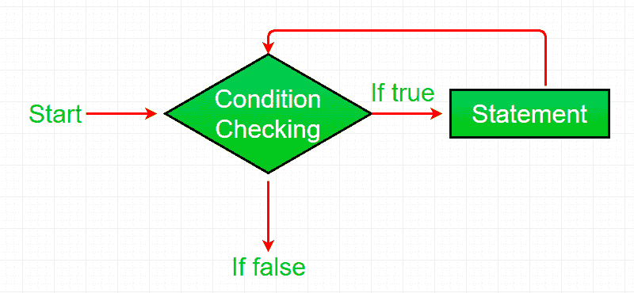

# 在 Perl 中循环时

> 原文:[https://www.geeksforgeeks.org/while-loop-in-perl/](https://www.geeksforgeeks.org/while-loop-in-perl/)

[Perl](https://www.geeksforgeeks.org/introduction-to-perl/) 中的 while [循环](https://www.geeksforgeeks.org/perl-loops-for-foreach-while-do-while-until-nested-loops/)一般在括号中取一个表达式。如果表达式为真，则执行 while 循环体中的代码。当我们不知道希望循环执行的次数，但是我们知道循环的终止条件时，就使用 while 循环。也称为**入口控制循环**，因为在执行循环之前会检查条件。while 循环可以看作是一个重复的 if 语句。

**语法:**

```
while (condition)
{
    # Code to be executed
}

```

**流程图:**



**示例:**

```
# Perl program to illustrate
# the while loop

# while loop
$count = 3;
while ($count >= 0)
{
    $count = $count - 1;
    print "GeeksForGeeks\n";
}
```

**输出:**

```
GeeksForGeeks
GeeksForGeeks
GeeksForGeeks
GeeksForGeeks

```

### 嵌套 while 循环

嵌套 while 循环是指在另一个 while 循环中使用一个 while 循环。在嵌套 while 循环中，对于外部 while 循环的每次迭代，内部 while 循环都将完全执行。

```
#!/usr/bin/perl
# Perl program for Nested while loop
$a = 0;  

# while loop execution  
while( $a <= 2 )
{  
    $b = 0;  
    while( $b <= 2 )
    {  
        printf "$a $b\n";  
        $b++;  
    }  
    $a++;  
}  
```

**输出:**

```
0 0
0 1
0 2
1 0
1 1
1 2
2 0
2 1
2 2

```

### 无限循环

而循环可以执行无限次，这意味着这个循环没有终止条件。换句话说，我们可以说有些条件总是成立的，这会导致 while 循环执行无限次，或者我们可以说它永远不会终止。

下面的程序将无限时间打印指定的语句，并在联机 IDE 上给出运行时错误为*超出输出限制*

```
# Perl program to illustrate
# the infinite while loop

# infinite while loop
# containing condition 1 
# which is always true
while(1)
{
    print "Infinite While Loop\n";
}
```

**输出:**

```
Infinite While Loop
Infinite While Loop
Infinite While Loop
Infinite While Loop
.
.
.
.

```